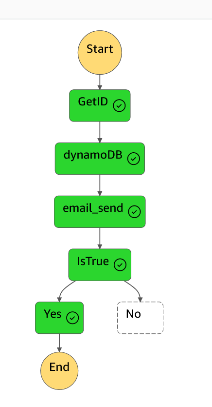

# Got Email when Ec2 instance stopped

# Summary
    Wehn EC2 instance stopped it trigger the Event Bridge. Event bridge trigger Step function. Which Invoke the Lambda function. We have 3 lambda function.
    1 Get value which instance is stopped
    2 Upload instance ID into DynamoDB
    3 Get value from DynamoDB and email to reciever.

